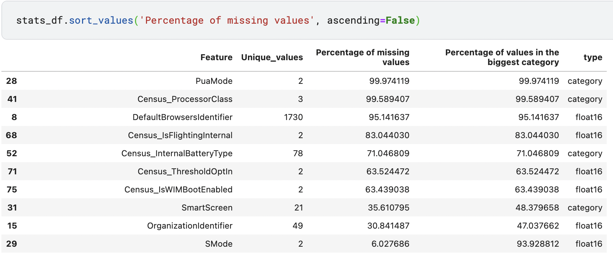

# Data Science Portfolio: Cybersecurity Focus

## Table of Contents
1. [Overview](#1-overview)
2. [Key Lessons Learned](#2-key-lessons-learned)
3. [Solution Summary](#3-solution-summary)
    - [3.1 Data Preprocessing](#31-data-preprocessing)
        - [3.1.1 Introduction](#311-introduction)
        - [3.1.2 Data Cleaning](#312-data-cleaning)
        - [3.1.3 Importance of Each Concept](#313-importance-of-each-concept)
        - [3.1.4 Reflections](#314-reflections)
        - [3.1.5 Conclusion](#315-conclusion)
    - [3.2 Modeling](#32-modeling)
    - [3.3 Validation Strategy](#33-validation-strategy)
4. [Requirements](#4-requirements)
5. [Usage](#5-usage)
6. [Reflections](#6-reflections)
7. [Links](#7-links)

# 1. Overview
This repository documents my journey and learning from participating in the [Microsoft Malware Prediction competition on Kaggle](https://www.kaggle.com/c/microsoft-malware-prediction). The goal of this competition was to predict the probability that a machine running Windows 10 could be susceptible to malware attacks, based on various system features provided by Microsoft.

# 2. Key Lessons Learned
- **Emulating Real-World Solutions:** The approach focused on creating a model that could realistically be implemented in a production environment, not just optimized for competition scores.
- **Handling Large Datasets:** Developed strategies for managing and processing large datasets efficiently to prepare the data for modeling.

# 3. Solution Summary

## 3.1 Data Preprocessing

### 3.1.1 Introduction
Data preprocessing is a critical step in the data science workflow, especially in the context of cybersecurity. It involves cleaning and transforming raw data into a format that is suitable for analysis and modeling. This section will discuss various data preprocessing techniques used in this project, explaining their importance in a way that is accessible to non-technical business executives.

### 3.1.2 Data Cleaning
The Data Cleaning Process is essential for ensuring the quality and usability of the data. Here's an overview of the key steps involved and their significance:

#### Feature Removal
**Handling Missing Values:** Features with too many NaN (missing) values are deleted because they can skew the analysis and might lead to unreliable models. A threshold of 90% missing values is generally considered as a criterion for removal, as it indicates that the feature is largely absent and likely not useful for predictive modeling.

*Figure 1: Missing Values - This table shows the featurew with the highest percentages of missing values.  For example: PuaMode and Census_ProcessorClass have 99%+ missing values.*

- **Removing Unbalanced Features:** Features with highly unbalanced dimensions are deleted. For example, a feature where a single category dominates can be less informative for modeling. A common threshold for considering a feature as unbalanced is when more than 95% of the values are concentrated in one category. This high concentration means the feature will not contribute significantly to the model's ability to distinguish between different observations.

Features with highly unbalanced distributions provide little variance and can disproportionately influence the model’s outcome. Removing these features can lead to more robust and generalizable models.

#### Feature Categorization
- **Feature Splitting:** Features are split into categories: binary, numeric, and categorical. This helps in applying appropriate preprocessing techniques tailored to the nature of the data.

Splitting features based on their type (binary, numeric, categorical) is vital because it informs subsequent preprocessing steps like normalization, encoding, and handling of missing values, ensuring that each feature contributes optimally to the model’s predictive power.

### 3.1.4 Reflections
The data cleaning process is not just about improving the quality of the data; it's about setting a strong foundation for the subsequent stages of the data science project. In cybersecurity, where the stakes are high, ensuring clean and well-preprocessed data means better detection capabilities and more reliable insights.

### 3.1.5 Conclusion
By understanding and implementing effective data preprocessing strategies, we can significantly enhance the performance of cybersecurity models, leading to better protection measures against potential threats.

## 3.2 Modeling
- **Model Selection:** Utilized LightGBM for its efficiency with large datasets and categorical features handling.
- **Parameter Tuning:** Conducted parameter tuning to optimize the LightGBM model, ensuring the best possible performance.

## 3.3 Validation Strategy
- Ensured a robust validation strategy that mimics real-world deployment rather than optimizing for leaderboard position, emphasizing the importance of model generalization.

# 4. Requirements
- **Python Version:** 3.7.1
- **Major Libraries:** pandas, numpy, lightgbm, scikit-learn

# 5. Usage
1. **Data Preparation:** Run the notebooks under `notebooks/` to clean and prepare data.
2. **Model Training:** Execute model training scripts to train and save the model.
3. **Evaluation:** Evaluate the model's performance on a separate validation set to ensure generalizability.

# 6. Reflections
Participating in this competition offered invaluable insights into the practical aspects of machine learning projects, including the importance of data quality, thoughtful feature engineering, and the need for robust validation methods.

# 7. Links
- [Competition Data](https://www.kaggle.com/c/microsoft-malware-prediction/data)
- [My Kaggle Profile](https://www.kaggle.com/yourusername)
